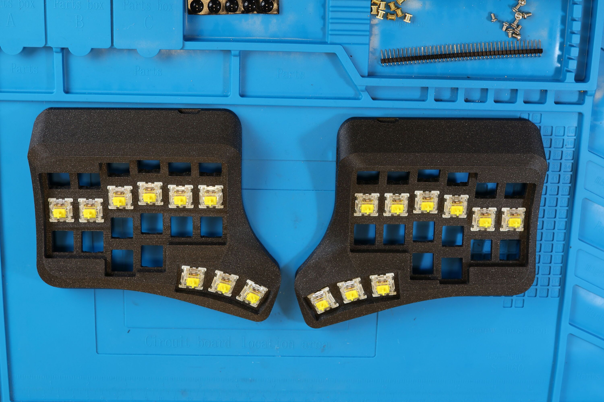
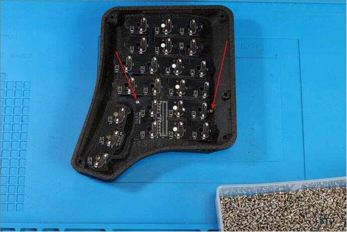
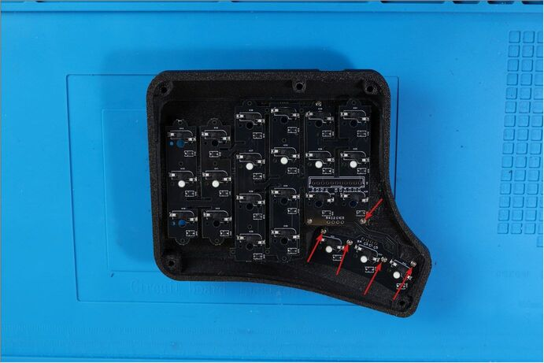
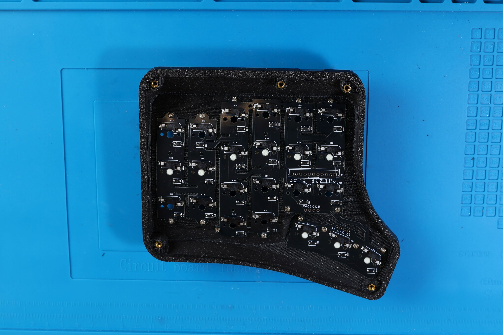
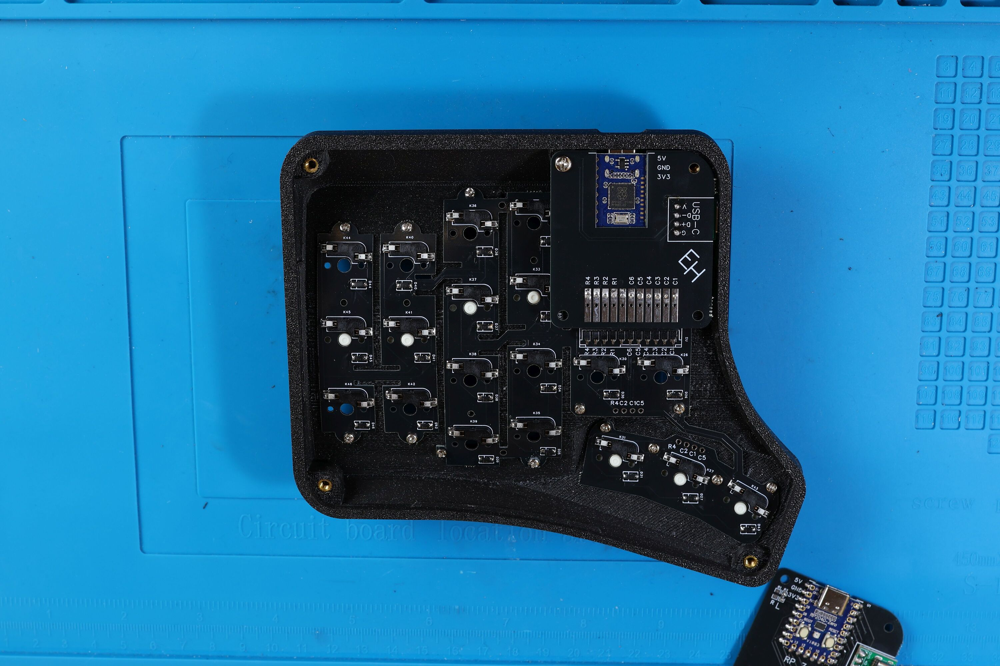
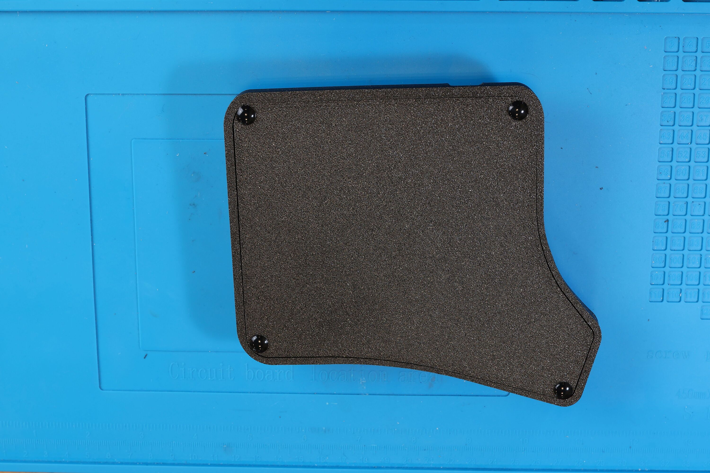

# Velvet v3 - how to assemble it yourself

## Components:

- Switchplate PCB (FR4, 0.8mm thickness) - 1 pc.
- MCU Holder PCB (FR4 1mm thickness) - 1 pc.
- 3D printed case - 2 pcs. (right and left halves)
- RP2040 Zero MCU - 2 pcs.
- MX Hotswap Sockets - 46 pcs.
- 1N4148W Diodes (SOD-123) - 46 pcs.
- 2 pcs. PLS pin connectors angular, male: 11 Pins, 2.54mm, 90 degree [(example)](https://aliexpress.ru/item/1005005614848270.html)
- 2 pcs. PBS sockets for connectors, female: 11 Pins, 2.54mm, 90 degree [(example)](https://aliexpress.ru/item/1005006067940562.html)
- 4 pcs. 10kOhm resistors (0805)
- USB Type-C mini-plate: 1.6mm thick [(example)](https://aliexpress.ru/item/1005005857575118.html)
- 30 pcs. M2x4 Screw [(example)](https://aliexpress.ru/item/1005005898007060.html)
- 10 pcs. M3x4 Inserts [(example)](https://aliexpress.ru/item/1005004290019650.html)
- 10 pcs. M3x4 Screw [(example)](https://aliexpress.ru/item/1005005898007060.html)
- Type-C to Type-C cable (for connecting halves)
- 3M bumpons/Silicone legs - 8 pcs. [(example)](https://aliexpress.ru/item/32912066603.html)
- MX switches - 46 pcs.
- Key caps - 46 pcs.

## Tools:

- Soldering iron
- Solder (flux-containing)
- Nippers
- Tweezers
- Screwdriver for M3 and M2 screws

## Assembly order

### Preparation of holders

1. Installation of resistors
2. Installation of the microcontroller
3. Installation of Type-C connectors
4. Installation of PBS 11-R connectors
5. Microcontroller firmware

### Preparing the switch plate

1. Applying solder to the pads
2. Installation of hotswap sockets and diodes

### Assembly into housing

1. Installation of switches
2. Installation of switchplate and brass inserts
3. Installation of the holder
4. Keyboard check
5. Installation of the lower plate

### Preparation of holders

#### Installing resistors

First you need to prepare the board for the holder. We install resistors on both halves of the holder.
On the right half - on the R3 platform, on the left - on R2.

#### Installing the microcontroller

Do not mix up the installation side. We place the microcontroller level and first solder pins 13 and 0 to fix it on the board. After we have fixed the microcontroller smoothly, we solder the remaining contacts.

#### Installing Type-C connectors

We place the Type-C connector on the holder and solder one contact on the back side to fix the PLS 4pin connector, as shown in Fig. 1.
Then, on the other side, we also solder one Type-C contact with a PLS connector, as shown in Fig. 2. Next, we add PLS, as shown in Fig. 3.
Then we cut off the extra legs with wire cutters and solder the Type-C connector.

#### Installing corner sockets

Next, we solder both PBS 11-R connectors and also cut off the legs on the reverse side with pliers so that they do not interfere with us placing the board in the case.

#### Microcontroller firmware

After we have finished soldering the holders, we need to flash them:
- Connect the microcontroller to the PC
- The microcontroller must be identified as a USB drive
- Drag and drop [firmware file](https://github.com/ergohaven/keymap_hub/) onto it
- The microcontroller is flashed

If your RP2040-Zero is not detected as a drive, then you need to
Hold down the Boot key on it and connect USB. Then repeat the steps of dragging the Uf2 firmware file.

### Preparing the switch plate

#### Applying solder to pads

First you need to prepare the board. To do this, we apply solder to the pads on one side of the component to make it easier to solder.

#### Installing hotswap sockets and diodes

Diodes have polarity and therefore it is important to install them with the correct side. The cathode is marked with a white line on the diode. The boards also have a silkscreen with the same line. We solder “line to line”.
All diodes must be installed in the same direction

Next, you need to install hotswap sockets into the hole and solder them.

### Assembly into housing

#### Setting switches

First you need to install the switches into the case, as shown in the figure.

#### Installing the switchplate and brass inserts

We attach it to the switches of the right half (we do not attach the tambo cluster yet) and tighten two M2x4mm screws, as shown in the figure.

Then we fix the tamb cluster and tighten five M2x4 mm screws, as shown in the figure.

Then we tighten the remaining screws and install five M3x5mm brass inserts with a heated soldering iron around the perimeter of the case, as shown in the figure below

The finished result should look like the picture

#### Installation of the holder

Take PLS 11-R and insert it into the connector on the holder, as shown in the figure

We install the holder and tighten the M3x4mm screw, as shown in the figure.

Next, pressing the holder all the way, solder each pin of the PLS connector to the switchplate.

We assemble the left half in the same way.

#### Keyboard check

After we have assembled both halves, we install all the switches, connect them to each other with a Type-C cable and connect the keyboard to the PC

Next, we will need to check the keyboard:
- Go to [Vial](https://get.vial.today/download/)
- Click on the “Matrix tester” menu, then “Unlock” and follow the instructions on the screen to unlock the keyboard
- We check every key

If all the keys work correctly, then we begin to tighten the lower plates

#### Installing the bottom plate

We place the plate into the case and tighten it with M3x4mm screws, then install silicone feet to hide the screws

Install your favorite keycaps and enjoy your new keyboard!

