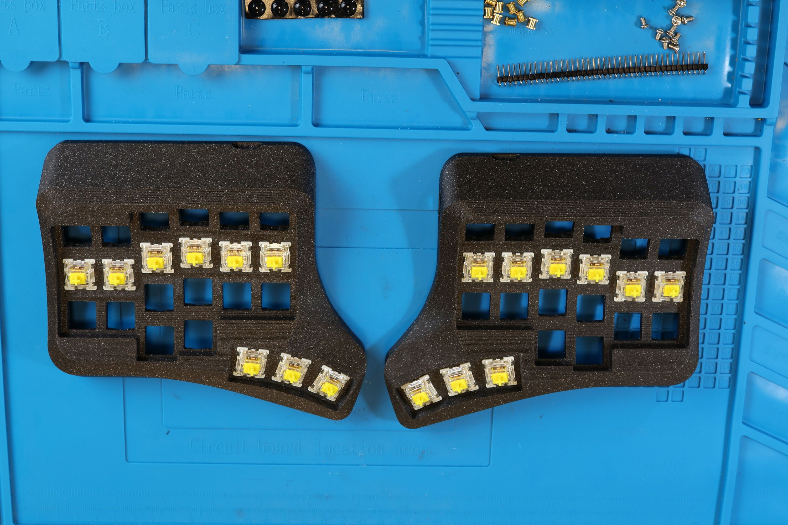
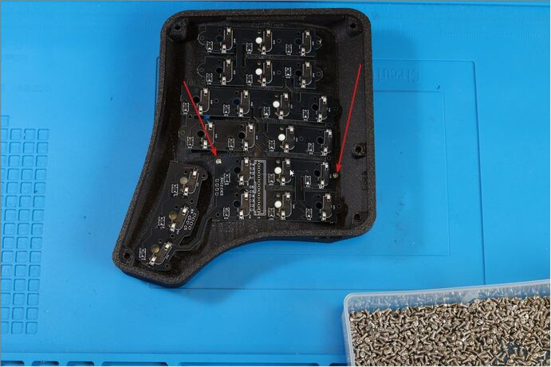
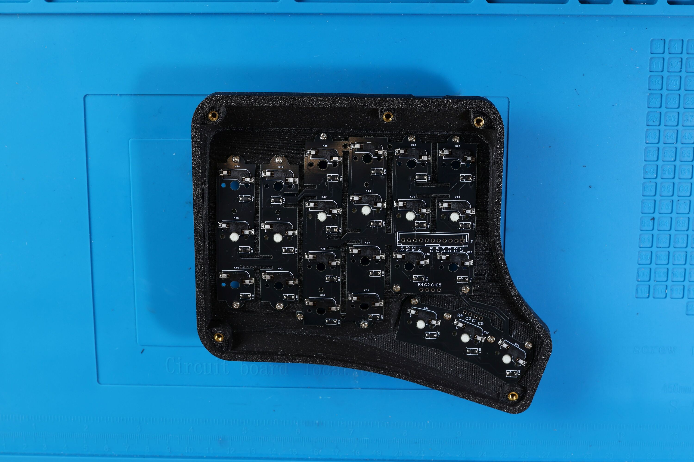
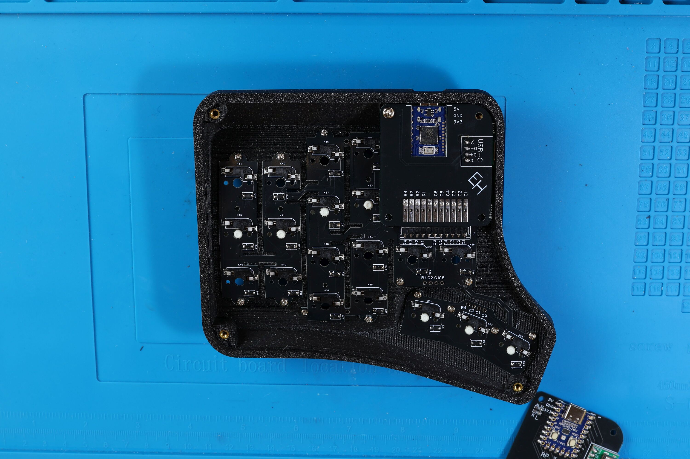
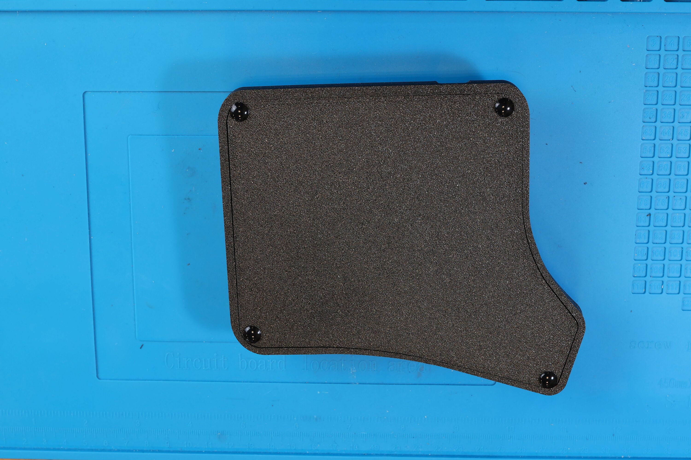

# Velvet v3 - как его собрать самостоятельно

## Компоненты:  

- PCB_Velvet3_switchplate - 1 шт. 
- PCB_Velvet3_holder - 1 шт.
- 3D корпус - 1 шт. (правая и левая половинки)
- RP2040 Zero микроконтроллер - 2 шт. 
- MX Хотсвап Сокеты - 46 шт.
- 1N4148W Диоды (SOD-123) - 46 шт.
- 2 шт. PLS пин коннекторы угловые, папа : 11 Pins, 2.54mm, 90 degree [(пример)](https://aliexpress.ru/item/1005005614848270.html)
- 2 шт. PBS сокеты для коннекторов, мама: 11 Pins, 2.54mm, 90 degree [(пример)](https://aliexpress.ru/item/1005006067940562.html)
- 4 шт. 10kOhm резисторы (0805)
- USB Type-C мини-плата: 1.6mm thick [(пример)](https://aliexpress.ru/item/1005005857575118.html)
- 30 шт. M2x4 Винт [(пример)](https://aliexpress.ru/item/1005005898007060.html)
- 10 шт. M3x4 Инсерты [(пример)](https://aliexpress.ru/item/1005004290019650.html) 
- 10 шт. M3x4 Винт [(пример)](https://aliexpress.ru/item/1005005898007060.html) 
- 1 шт. Type-C to Type-C кабель (для соединения половинок)
- Силиконовые ножки - 8 шт.
- Свитчи МХ - 46 шт.
- Кейкапы - 46 шт.

## Инструменты: 

- Паяльник
- Припой (флюсосодержащий)
- Кусачки
- Пинцет
- Отвёртка для винтов M3 и M2

## Порядок сборки

### Подготовка холдера 

1. Установка резисторов
2. Установка микроконтроллера
3. Установка Type-C коннекторов
4. Установка PBS 11-R коннекторов
5. Прошивка микроконтроллера

### Подготовка свитч плейта 

1. Нанесение припоя на контактные площадки
2. Установка хотсвап сокетов и диодов

### Сборка в корпус

1. Установка переключателей
2. Установка свитчплейта и латунных вставок
3. Установка холдера
4. Проверка клавиатуры
5. Установка нижнего плейта

### Подготовка холдера 

#### Установка резисторов

Для начала необходимо подготовить плату для холдера. Устанавливаем резисторы на обе половинки холдера. 
На правой половинке — на площадку R3, на левой — на R2.

#### Установка микроконтроллера

Не перепутайте сторону установки. Ставим ровно микроконтроллер и сначала запаиваем 13 и 0 пины, чтобы его зафиксировать на плате. После того, как мы ровно зафиксировали микроконтроллер - запаиваем остальные контакты. 

#### Установка Type-C коннекторов

Размещаем Type-C коннектор на холдере и запаиваем с обратной стороны один контакт, чтобы зафиксировать PLS 4pin коннектор, как показано на рис. 1.
Затем с другой стороны запаиваем также один контакт Type-C с PLS коннектором, как показано на рис.2. Далее допаиваем PLS, как показано на рис. 3.
После обрезаем лишние ножки кусачками и допаиваем Type-C коннектор.

#### Установка угловых сокетов 

Далее запаиваем оба PBS 11-R коннектора и также обрезаем кусачками ножки с обратной стороны, чтобы они не мешали нам для размещения платы в корпусе.

#### Прошивка микроконтроллера

После того, как мы закончили с пайкой холдеров, необходимо их прошить: 
- Подключаем микроконтроллер к ПК
- Микроконтроллер должен определиться как USB накопитель  
- Перетаскиваем на него [файл прошивки](https://github.com/ergohaven/keymap_hub/)  
- Микроконтроллер прошит  

Если у вас RP2040-Zero не определился как накопитель, то необходимо 
зажать на нём клавишу Boot и подключить USB. Затем повторить действия с перетаскивание Uf2 файла прошивки.

### Подготовка свитч плейта

####  Нанесение припоя на контактные площадки 

Для начала необходимо подготовить плату. Для этого наносим припой на контактные площадки с одной стороны компонента, чтобы его было легче припаивать.

#### Установка хотсвап сокетов и диодов

Диоды имеют полярность и поэтому важно устанавливать их правильной стороной. Катод отмечен белой линией на диоде. На платах также имеется шёлкография с такой же линией. Паяем «линия к линии».
Все диоды должны быть установлены в одном направлении

Далее необходимо установить в отверстие хотсвап сокеты и запаять.

  

### Сборка в корпус

#### Установка переключателей

Для начала необходимо установить свитчи в корпус, как показано на рисунке 

#### Устанавливаем свитчплейт и латунные вставки

Закрепляем его на свитчи правой половинки (тамб-кластер пока не закрепляем) и закручиваем два винта М2х4мм, как показано на рисунке.

Затем закрепляем тамб-кластер и закручиваем пять винтов М2х4 мм., как показано на рисунке.

После закручиваем остальные винты и устанавливаем пять латунных вставок М3х5мм разогретым паяльником по периметру корпуса, как показано на рисунке ниже

Готовый результат должен выглядеть как на рисунке

#### Установка холдера 

Берём PLS 11-R и вставляем в коннектор на холдере, как показано на рисунке 

Устанавливаем холдер и закручиваем М3х4мм винт, как показано ни рисунке. 

Далее, придавливая холдер до упора, запаиваем каждый пин PLS разъёма на свитчплейт. 

Левую половинку собираем аналогично.

#### Проверка клавиатуры

После того, как мы собрали обе половинки, устанавливаем все свитчи, соединяем их между собой Type-C кабелем и подключаем клавитуру к ПК

Далее, нам необходимо будет проверить клавиатуру:  
- Заходим в [Vial](https://get.vial.today/download/)  
- Кликаем на меню “Matrix tester”, дальше “Unlock” и следуем инструкции на экране для разблокировки клавиатуры  
- Проверяем каждую клавишу

Если все клавиши работают корректно, то начинаем закручивать нижние плейты

#### Установка нижнего плейта

Помещаем плейт в корпус и закручиваем его М3х4мм винтами, затем устанавливаем силиконовые ножки, чтобы скрыть винты

Установите Ваши любимые кейкапы и наслаждайтесь удобством и эргономикой!

